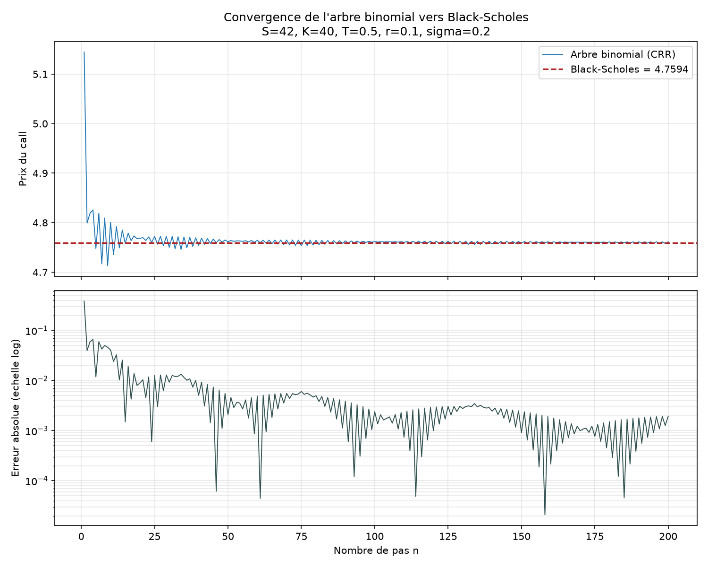
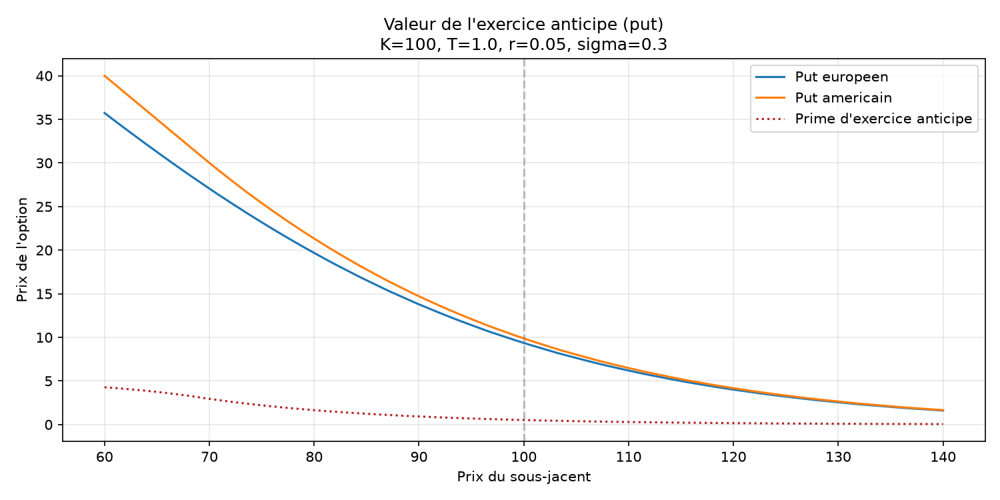

# Pricer d'options européennes et américaines

Valorisation d'options par trois méthodes indépendantes, validées les unes
contre les autres : formule fermée de Black-Scholes, arbre binomial de
Cox-Ross-Rubinstein, et simulation de Monte Carlo.

## Motivation

Trois algorithmes construits séparément doivent converger vers le même prix et
cet accord est la vérification principale du projet

## Méthodes

### Black-Scholes (formule fermée)

Prix exact sous les hypothèses du modèle, obtenu en résolvant analytiquement
l'espérance risque-neutre actualisée du payoff. Sert de base pour les deux
autres méthodes.

Les cinq grecques sont dérivées analytiquement et confrontées à leurs
différences finies centrées.

### Arbre binomial (Cox-Ross-Rubinstein)

Discrétisation du temps en `n` pas, avec `u = exp(σ√Δt)` et `d = 1/u`. Le choix
`ud = 1` fait recombiner l'arbre : `n+1` nœuds terminaux au lieu de `2^n`. La
probabilité risque-neutre `q = (exp(rΔt) − d)/(u − d)` est calibrée pour que le
sous-jacent croisse exactement au taux sans risque.

Intérêt spécifique : la récursion arrière examine chaque nœud intermédiaire, ce
qui permet de comparer valeur de continuation et exercice immédiat, donc de
valoriser les options américaines ce qui est impossible avec la formule fermée.

### Monte Carlo

Simulation vectorisée de `N` trajectoires terminales sous la mesure
risque-neutre. L'erreur type décroît en `O(1/√N)` d'après le théorème central
limite, ce qui fournit des intervalles de confiance — la seule des trois
méthodes à quantifier sa propre incertitude.

Réduction de variance par variables antithétiques : pour chaque `Z` tiré, on
simule aussi `−Z`, et on moyenne les payoffs par paire. La corrélation négative
entre les deux réduit la variance de l'estimateur sans coût supplémentaire.

## Résultats

Paramètres de référence (Hull, ch. 15) : `S = 42`, `K = 40`, `T = 0,5`,
`r = 10 %`, `σ = 20 %`.

**Call européen**

| Méthode | Prix | Écart / BS | Temps |
|---|---:|---:|---:|
| Black-Scholes | 4,7594 | — | 0,61 ms |
| Binomial (n = 2000) | 4,7595 | +0,0001 | 8,41 ms |
| Monte Carlo (500k) | 4,7583 | −0,0011 | 17,39 ms |
| MC antithétique (500k) | 4,7616 | +0,0022 | 15,04 ms |

**Put européen**

| Méthode | Prix | Écart / BS | Temps |
|---|---:|---:|---:|
| Black-Scholes | 0,8086 | — | 0,41 ms |
| Binomial (n = 2000) | 0,8087 | +0,0001 | 8,32 ms |
| Monte Carlo (500k) | 0,8098 | +0,0012 | 16,05 ms |
| MC antithétique (500k) | 0,8098 | +0,0012 | 14,18 ms |

Les trois méthodes s'accordent au millième près. Les écarts Monte Carlo restent
dans l'intervalle de confiance à 95 %.

**Réduction de variance par variables antithétiques**

| | Erreur type simple | Erreur type antithétique | Réduction |
|---|---:|---:|---:|
| Call | 0,00703 | 0,00348 | 50,5 % |
| Put | 0,00257 | 0,00231 | 10,3 % |

L'écart entre les deux est instructif. Avec `S = 42` et `K = 40`, le call est
dans la monnaie : son payoff est actif sur une large plage de `Z` et se comporte
presque linéairement, ce qui rend la corrélation négative entre `Z` et `−Z`
très forte. Le put est hors la monnaie et ne paie que dans environ 27 % des
scénarios : pour la plupart des paires, l'un des deux payoffs est nul, donc
aucune compensation n'est possible. Les variables antithétiques sont d'autant
plus efficaces que le payoff est monotone et proche de linéaire — une raison de
mesurer la réduction plutôt que de la supposer.

**Grecques analytiques (call)**

| Grecque | Valeur | Lecture |
|---|---:|---|
| Delta | 0,7791 | le prix gagne 0,78 $ si le sous-jacent monte de 1 $ |
| Gamma | 0,0500 | le delta gagne 0,05 par dollar de hausse |
| Vega | 8,8134 | +0,0881 $ par point de volatilité |
| Theta | −4,5591 | −0,0125 $ par jour écoulé |
| Rho | 13,9820 | +0,14 $ par point de taux |

**Exercice anticipé** — put dans la monnaie, `S = 90`, `K = 100`, `T = 1`,
`r = 5 %`, `σ = 30 %` :

| | Prix |
|---|---:|
| Put européen | 13,7863 |
| Put américain | 14,7083 |
| Prime d'exercice anticipé | 0,9220 (6,69 %) |

Sans dividendes, cette prime est identiquement nulle pour un call : exercer tôt
reviendrait à payer le strike plus tôt et à abandonner la valeur temps. Pour un
put, exercer libère `K` immédiatement, plaçable au taux sans risque — l'arbitrage
s'inverse dès que le sous-jacent est suffisamment bas.

## Figures

L'erreur décroît en `O(1/n)`, mais de façon oscillante : la position du strike
relativement aux nœuds terminaux change avec la parité de `n`. Des variantes
comme l'arbre de Leisen-Reimer corrigent cet effet en plaçant `K` exactement sur
un nœud.

La prime est nulle hors la monnaie et croît à mesure que le put y entre.

## Validation

XX tests automatisés (`pytest`), répartis en quatre familles :

- **Valeurs de référence** — comparaison aux exemples chiffrés de Hull.
- **Propriétés sans modèle** — parité put-call sur une grille de paramètres,
  bornes d'arbitrage (`C ≥ S − Ke^{−rT}`, `C ≤ S`, `P ≤ Ke^{−rT}`). Ces tests ne
  dépendent d'aucune référence externe et doivent passer pour tout jeu d'entrées.
- **Dérivées** — chaque grecque analytique confrontée à sa différence finie
  centrée.
- **Accord entre méthodes** — convergence du binomial vers Black-Scholes,
  appartenance du prix exact à l'intervalle de confiance Monte Carlo, décroissance
  de l'erreur en `1/√N`, et égalité call américain / call européen sans dividendes.

## Conventions

- Taux `r` en composition continue ; maturité `T` en années.
- `theta` suit la convention des desks : `−∂C/∂T`, donc négatif pour une position
  acheteuse. Exprimé par année ; diviser par 365 pour l'érosion quotidienne.
- `vega` est la dérivée brute par unité de `σ` ; diviser par 100 pour la
  sensibilité à un point de volatilité.

## Limites du modèle

Le modèle suppose une volatilité constante, des trajectoires continues et des
rendements lognormaux. Ces hypothèses sont empiriquement fausses